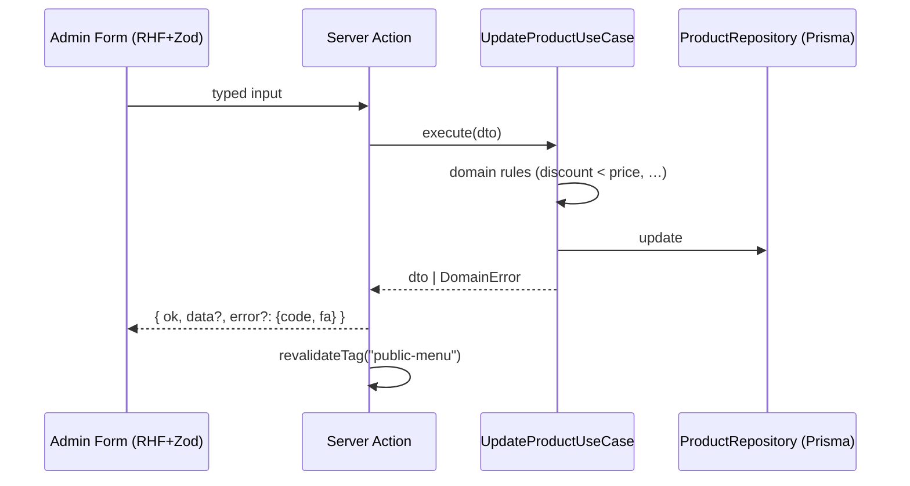

# 03 · Architecture

## Layered Clean Architecture

Dependency rule (inward only):

```mermaid
flowchart LR
  UI[components / app routes] --> APP[application: use-cases, schemas, DTOs]
  APP --> DOM[domain: entities, errors, ports]
  INF[infrastructure: prisma repos, storage, auth] -.implements.-> DOM
  UI --> INF  %% only via composition root (container), never directly
```

- **domain**: pure TS types + business rules + repository *interfaces* (ports).
  Zero imports from other layers. No framework imports.
- **application**: one class per use-case, constructor-injected ports, Zod schemas,
  DTOs (never exposes Prisma types).
- **infrastructure**: Prisma repositories implementing ports, local storage adapter,
  Sharp optimizer, argon2 password adapter, jose session adapter, rate limiter,
  **composition root** (`container.ts`).
- **app / components**: thin. Routes parse input → call use-case via container →
  map result. Components are presentational.

## Folder tree

```text
src/
├── app/
│   ├── layout.tsx · globals.css · not-found.tsx · error.tsx
│   ├── (public)/ layout.tsx · page.tsx
│   ├── login/page.tsx
│   ├── admin/
│   │   ├── layout.tsx            # sidebar, guard, unsaved-changes context
│   │   ├── products/page.tsx     # list + drawer form + dnd + preview button
│   │   ├── categories/page.tsx
│   │   └── settings/page.tsx
│   ├── api/admin/media/upload/route.ts   # XHR upload w/ progress
│   ├── api/health/route.ts
│   └── media/[mediaId]/route.ts  # optimized image serving (?w=320|640|960)
├── components/
│   ├── ui/                       # shadcn primitives
│   ├── menu/                     # PURE presentational: hero, tabs, product-card,
│   │                             #   variant-list, badge, price-tag, section, empty-state
│   ├── admin/                    # product-form, category-form, upload-editor,
│   │                             #   dnd-list, confirm-dialog, preview-phone
│   └── phone-frame.tsx
├── domain/
│   ├── entities.ts · errors.ts · ports.ts
├── application/
│   ├── dtos.ts · schemas.ts
│   └── use-cases/
│       ├── menu/get-public-menu.ts
│       ├── categories/{list,create,update,delete,reorder}-category.ts
│       ├── products/{list,get,create,update,delete,reorder}-product.ts
│       ├── media/{upload,delete}-media.ts
│       ├── settings/{get,update}-settings.ts
│       └── auth/{login,logout,change-password,verify-session}.ts
├── infrastructure/
│   ├── prisma/client.ts · repositories/*.ts
│   ├── storage/local-disk-storage.ts
│   ├── image/optimizer.ts
│   ├── auth/{password,session,rate-limiter}.ts
│   └── di/container.ts
├── lib/
│   ├── env.ts                    # zod-validated process.env
│   ├── format/{price,digits}.ts
│   ├── fa/strings.ts             # ALL Persian UI strings
│   └── utils.ts
└── hooks/
```

## Composition root

`infrastructure/di/container.ts` builds the object graph once (module singleton):

```ts
// pseudo-code
const productRepo = new PrismaProductRepository(prisma);
export const container = {
  getPublicMenu: () => new GetPublicMenuUseCase(productRepo, categoryRepo, settingsRepo),
  createProduct: () => new CreateProductUseCase(productRepo, mediaStorage),
  // …one factory per use-case
};
```

Server actions obtain use-cases ONLY through `container`.

## Data flow (public menu)

1. RSC `page.tsx` → `container.getPublicMenu().execute()`
2. Use-case returns `PublicMenuDto` (settings + category tree + products + variants)
3. Result cached with React `cache()` + `unstable_cache` tagged `"public-menu"`
4. Every admin mutation calls `revalidateTag("public-menu")` after success.

## Data flow (mutation, e.g. update product)



## Error flow

Use-cases throw typed domain errors (`NotFoundError`, `ValidationError`,
`CategoryNotEmptyError`, …). The server-action wrapper catches and maps
`error.code → Persian message` via `lib/fa/strings.ts`. HTTP routes return JSON
with the same shape.

## Caching & image serving

- Public menu: tagged cache (step above).
- `/media/[mediaId]?w=`: streams Sharp-optimized WebP from disk;
  `Cache-Control: public, max-age=31536000, immutable` (content-addressed filenames).

## Conventions

- Server actions live in `src/app/admin/**/_actions.ts` (thin, ≤ 60 lines each).
- No business logic, no Prisma, no direct env access outside their layers.
- `lib/env.ts` is the only place reading `process.env`.