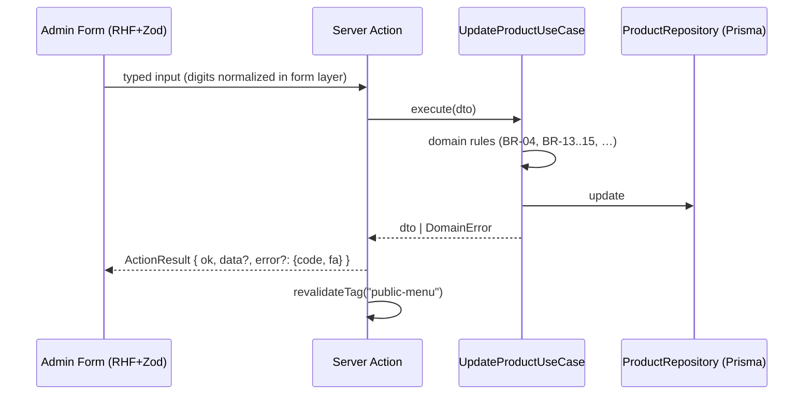

# 03 · Architecture

## Layered Clean Architecture

Dependency rule (inward only):

```mermaid
flowchart LR
  UI[components / app routes] --> APP[application: use-cases, schemas, DTOs, mappers]
  APP --> DOM[domain: entities, errors, ports]
  INF[infrastructure: prisma repos, storage, auth] -.implements.-> DOM
  UI --> INF  %% only via composition root (container), never directly
```

- **domain**: pure TS types + business rules + repository *interfaces* (ports).
  Zero imports from other layers. No framework imports.
- **application**: one class per use-case, constructor-injected ports, Zod schemas,
  DTOs (never exposes Prisma types), **pure mappers** (`toPublicMenu`).
- **infrastructure**: Prisma repositories implementing ports, local storage adapter,
  Sharp optimizer, argon2 password adapter, jose session adapter, rate limiter,
  **composition root** (`container.ts`).
- **app / components**: thin. Routes parse input → call use-case via container →
  map result. Components are presentational.

## Folder tree (complete — new files must fit here)

```text
src/
├── middleware.ts                 # session guard for /admin/**, /api/admin/**
├── app/
│   ├── layout.tsx · globals.css · not-found.tsx · error.tsx
│   ├── (public)/ layout.tsx · page.tsx
│   ├── login/ page.tsx · _actions.ts
│   ├── admin/
│   │   ├── page.tsx              # redirects to /admin/products
│   │   ├── layout.tsx            # sidebar/bottom-nav, guard, draft hydration, unsaved-changes
│   │   ├── products/ page.tsx · _actions.ts
│   │   ├── categories/ page.tsx · _actions.ts
│   │   └── settings/ page.tsx · _actions.ts
│   ├── api/
│   │   ├── admin/media/upload/route.ts   # XHR upload w/ progress (auth required)
│   │   └── health/route.ts
│   └── media/[mediaId]/route.ts  # public optimized image serving (?w=320|640|960)
├── components/
│   ├── ui/                       # shadcn primitives
│   ├── menu/                     # PURE presentational: hero, tabs, chips, product-card,
│   │                             #   variant-list, badge, price-tag, section, empty-state,
│   │                             #   menu-image (next/image + media loader)
│   ├── admin/                    # product-form, category-form, upload-editor,
│   │                             #   dnd-list, confirm-dialog, preview-phone
│   └── phone-frame.tsx
├── domain/
│   ├── entities.ts · errors.ts · ports.ts
│   └── testing/                  # in-memory fakes for every port
├── application/
│   ├── dtos.ts · schemas.ts
│   ├── mappers/to-public-menu.ts # pure: AdminMenuDto → PublicMenuDto
│   └── use-cases/
│       ├── menu/{get-public-menu,get-admin-menu}.ts
│       ├── categories/{list,create,update,delete,reorder}-category.ts
│       ├── products/{list,get,create,update,delete,reorder}-product.ts
│       ├── media/{upload,delete}-media.ts
│       ├── settings/{get,update}-settings.ts
│       └── auth/{login,logout,change-password,verify-session}.ts
├── infrastructure/
│   ├── prisma/client.ts · repositories/*.ts
│   ├── storage/local-disk-storage.ts
│   ├── image/optimizer.ts        # Sharp: variants + dominant color
│   ├── auth/{password,session,rate-limiter}.ts
│   └── di/container.ts
├── lib/
│   ├── env.ts                    # zod-validated process.env (only place reading env)
│   ├── constants.ts              # limits, durations, sizes (no magic values)
│   ├── format/{price,digits}.ts
│   ├── media-url.ts              # mediaUrl(id, width) helper
│   ├── fa/strings.ts             # ALL Persian UI strings (typed keys)
│   └── utils.ts
└── hooks/                        # use-unsaved-warning, use-reduced-motion-safe, …
e2e/                              # Playwright specs
prisma/                           # schema, migrations, seed.ts
scripts/                          # admin-reset.ts
```

## Composition root

`infrastructure/di/container.ts` builds the object graph once (module singleton):

```ts
// pseudo-code
const productRepo = new PrismaProductRepository(prisma);
export const container = {
  getPublicMenu: () => new GetPublicMenuUseCase(productRepo, categoryRepo, settingsRepo),
  createProduct: () => new CreateProductUseCase(productRepo, categoryRepo, mediaStorage),
  // …one factory per use-case
};
```

Server actions and route handlers obtain use-cases ONLY through `container`.

## Routes

| Route | Type | Auth | Purpose |
| --- | --- | --- | --- |
| `/` | RSC | public | Public menu |
| `/login` | RSC + action | public (redirects to `/admin/products` when authed) | Login |
| `/admin` | RSC | required | Redirects to `/admin/products` |
| `/admin/products` `/admin/categories` `/admin/settings` | RSC + actions | required | Admin sections |
| `/api/admin/media/upload` | route handler (POST) | required | XHR upload with progress |
| `/api/health` | route handler (GET) | public | `{ ok: true, db: true }` |
| `/media/[mediaId]?w=` | route handler (GET) | public | Serves pre-generated WebP variants |

Middleware (`src/middleware.ts`, edge runtime, jose only — no Prisma/argon2) verifies
the session cookie for `/admin/**` and `/api/admin/**`. It is defense-in-depth:
every server action and route handler re-verifies the session via
`VerifySessionUseCase` (doc 10).

## Data flow (public menu)

1. RSC `page.tsx` → `container.getPublicMenu().execute()`
2. Use-case loads settings + full category tree, then maps via the **pure**
   `toPublicMenu()` mapper (applies HIDE/MUTED, drops empty categories)
3. Result cached with React `cache()` + `unstable_cache` tagged `"public-menu"`
4. Every successful admin mutation calls `revalidateTag("public-menu")`

The admin live preview calls the **same** `toPublicMenu()` mapper client-side with
draft data — this is what guarantees preview == production rendering (doc 07).

## Data flow (mutation, e.g. update product)



## Error flow

Use-cases throw typed domain errors (`NotFoundError`, `ValidationError`,
`CategoryNotEmptyError`, `RateLimitError`, …). The server-action wrapper catches and
maps `error.code → Persian message` via `lib/fa/strings.ts`, returning
`ActionResult<T> = { ok: true, data: T } | { ok: false, error: { code: string, fa: string } }`.
HTTP routes return JSON with the same shape. Unexpected errors are logged and mapped
to a generic Persian message; stack traces never reach the UI.

## Media pipeline (authoritative — docs 04/06/07/10/11 defer to this section)

**Naming**: files are `cuid().ext` — unique per upload, therefore safe for immutable
caching. They are *not* content-addressed; identical bytes uploaded twice produce
two files (accepted; storage is cheap, duplicates are rare).

**Storage layout** under `STORAGE_ROOT` (default `/data/storage`):

```text
uploads/{mediaId}.jpg        # cropped original (as received, JPEG q0.92)
uploads/{mediaId}_320.webp   # pre-generated variants
uploads/{mediaId}_640.webp
uploads/{mediaId}_960.webp
```

Originals keep their received extension; `deleteAll` covers jpg/png/webp originals + 3 WebP variants.

**Upload flow** (details in doc 07):
client crop (4:3) → JPEG blob → XHR `POST /api/admin/media/upload` →
auth → magic bytes (jpeg/png/webp) → ≤ 5MB → ratio 4:3 ±2% →
Sharp: save original, generate 3 WebP variants, extract `dominantColor`
(`sharp.stats()` dominant channel) → insert Media row → return
`{ mediaId, dominantColor, width, height }`. Clients build URLs with
`lib/media-url.ts`: `mediaUrl(id, w) → /media/{id}?w={320|640|960}`.

**Serving**: `app/media/[mediaId]/route.ts` looks up the Media row, validates
`w ∈ {320,640,960}` (default 640), streams the pre-generated file with
`Cache-Control: public, max-age=31536000, immutable`. Unknown id/invalid w → 404.
Originals are never served.

**Rendering**: `components/menu/menu-image.tsx` wraps `next/image` with a custom
`loader` that maps requested width to the nearest variant (≤320→320, ≤640→640,
else 960). Next's own optimizer is bypassed for these images.

**Deletion**: deleting a product (or replacing/removing its image) deletes the
Media row and all 4 files after the DB transaction succeeds (BR-03). If product
creation is cancelled after an upload, the form calls `DeleteMediaUseCase`
(no orphan files).

## Caching

- Public menu: tagged cache (above).
- `/media/[mediaId]`: immutable 1y (unique filenames).
- Admin HTML: `Cache-Control: no-store`.
- Public HTML: `s-maxage=60` + tag revalidation on mutations.

## Conventions

- Server actions live in `src/app/**/_actions.ts` next to their page
  (thin, ≤ 60 lines each).
- No business logic, no Prisma, no direct env access outside their layers.
- `lib/env.ts` is the only place reading `process.env`.
- All numeric form inputs accept Persian and ASCII digits; normalization happens
  in the form layer via `lib/format/digits.ts` **before** Zod parsing.
