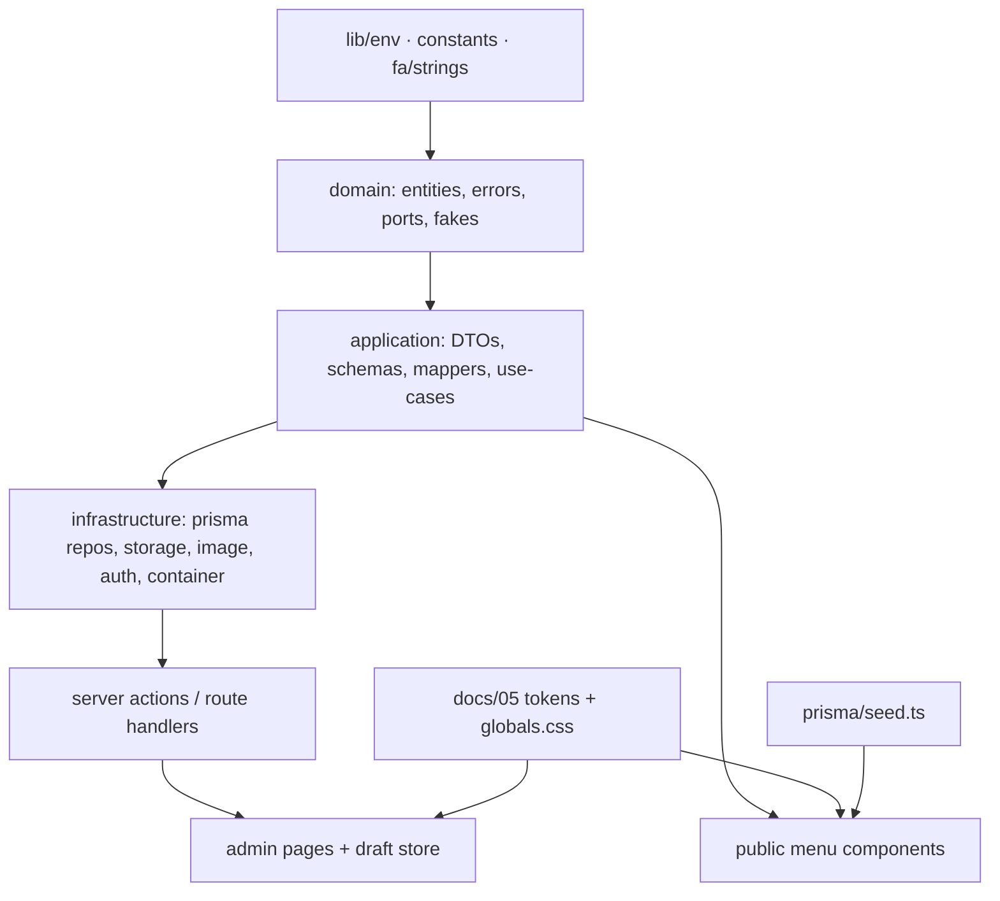

# 13 · Implementation Plan (Task Tree, Dependencies, Milestones)

Rules: one milestone per PR/session · TDD per doc 09 (tests first, locally) ·
run `pnpm check` + relevant E2E before marking done · commit convention per
AGENTS.md · docs are the source of truth — if code and docs disagree, fix the
code or stop and update the docs in the same commit.

**Tracking**: when a task is complete, strike through its ID cell
(`~~T-001~~`) in the same commit that finishes it.

## Dependency graph (modules)

Critical path: **M0 → M1 → M2 → M3 → M4 → M5 → M6 → M7 → M8** (strictly ordered).
Within a milestone, tasks marked ∥ can be done in any order / parallel.

## Task tree

Format: `ID · description · [docs] · deps · output · tests`.

### M0 · Bootstrap

| ID | Task | Docs | Deps | Output | Tests |
| --- | --- | --- | --- | --- | --- |
| ~~T-001~~ | Next 15 + TS strict + Tailwind + shadcn + ESLint flat + Prettier + pinned deps (doc 02) | 02 | — | runnable app shell | `pnpm check` |
| ~~T-002~~ | `dir=rtl lang=fa`, fonts (IRANSans local w/ Vazirmatn fallback, Markazi Text), globals.css with **all** doc-05 tokens for 4 themes | 05 | T-001 | themed blank page | visual check |
| ~~T-003~~ | `lib/env.ts`, `lib/fa/strings.ts`, `lib/constants.ts`, `lib/utils.ts`, `lib/format/{price,digits}.ts` | 03, 04 | T-001 | utils + **golden price/digit unit tests** | `pnpm test` |
| ~~T-004~~ | docker compose (db + test profile), Prisma schema + initial migration | 04, 12 | T-001 | migrated DB | `prisma migrate dev` green |
| ~~T-005~~ | `/api/health`, custom 404/error shells | 03 | T-001 | health JSON, branded 404 | curl + manual |

### M1 · Domain & Infrastructure Core

| ID | Task | Docs | Deps | Output | Tests |
| --- | --- | --- | --- | --- | --- |
| ~~T-010~~ | `domain/entities.ts`, `errors.ts`, `ports.ts` | 03, 04 | T-004 | domain compiles standalone | typecheck |
| ~~T-011~~ | Prisma repositories (all ports) + in-memory fakes in `domain/testing/` | 04 | T-010 | repos + fakes | unit smoke |
| ~~T-012~~ | `di/container.ts` constructing every use-case | 03 | T-011 | container | construct-all test |
| ~~T-013~~ | `toPublicMenu` mapper | 04 | T-010 | pure mapper | unit: HIDE/MUTED/pruning |
| ~~T-014~~ ∥ | menu/category/product/settings use-cases plus media use-cases and stub storage/optimizer adapters (included to satisfy the docs/04 contract-completeness checklist); auth use-cases (Login/Logout/ChangePassword/VerifySession) remain deferred to M2 by design | 04 | T-011 | use-case classes | unit per BR (01..16; BR-03/11 via media) |

### M2 · Auth & Recovery

| ID | Task | Docs | Deps | Output | Tests |
| --- | --- | --- | --- | --- | --- |
| ~~T-020~~ | auth use-cases (login/logout/change-password/verify-session) + Zod | 04, 10 | T-014 | use-cases | unit incl. rate-limit |
| ~~T-021~~ | argon2 adapter, jose session adapter, in-memory rate limiter | 10 | T-011 | adapters | unit |
| ~~T-022~~ | `/login` page + `_actions.ts`, `middleware.ts`, `/admin` redirect | 03, 07, 10 | T-020 | working login | E2E `auth.spec` (excl. lockout) |
| ~~T-023~~ | `scripts/admin-reset.ts` + MASTER env path | 10 | T-020 | CLI | manual + log assertion |
| ~~T-024~~ | lockout E2E (5 fails → RATE_LIMITED string) | 09, 10 | T-022 | green spec | E2E `auth.spec` full |

### M3 · Seed + Public Menu v1

| ID | Task | Docs | Deps | Output | Tests |
| --- | --- | --- | --- | --- | --- |
| T-030 | `prisma/seed.ts`: full real menu + deterministic SVG placeholder generator (+ optional download flag) | 04, 02 (ADR-10) | T-014 | seeded DB offline | seed idempotency test |
| T-031 | `GetPublicMenuUseCase` + tagged cache + `revalidateTag` helper | 03, 04 | T-013, T-030 | cached DTO | unit |
| T-032 | Public page: hero, sticky tabs + scrollspy, sections, product card, skeletons, empty/error states | 05, 06 | T-031 | rendered menu | E2E `public-menu.spec` (basic rows 1–2) |
| T-033 | media pipeline: SharpImageOptimizer (original + 320/640/960 WebP + dominantColor), /media/[mediaId] route, MenuImage + lib/media-url.ts | 03, 05, 06 | T-030 | optimized images + route | unit + E2E image asserts |

### M4 · Public Menu Polish

| ID | Task | Docs | Deps | Output | Tests |
| --- | --- | --- | --- | --- | --- |
| T-040 | Variants expand («از …»), discount UI, badges, MUTED/HIDE, chips filter | 04, 05, 06 | T-032 | full card behaviors | E2E rows 3–6 |
| T-041 | Animation catalog A-01..A-08 + reduced motion | 05, 06 | T-032 | motion | reduced-motion check |
| T-042 ∥ | Desktop 2-col grid only | 03, 06 | T-033 | responsive grid | E2E layout asserts |
| T-043 | a11y pass + `a11y.spec` + Lighthouse ≥ 90 | 11 | T-040, T-041 | green scans | E2E `a11y.spec` |

### M5 · Admin: Products

| ID | Task | Docs | Deps | Output | Tests |
| --- | --- | --- | --- | --- | --- |
| T-050 | Admin layout (sidebar/bottom-nav), draft store + hydration (`GetAdminMenu`), unsaved-changes guard | 03, 07 | T-022, T-013 | shell + store | unit store mutators |
| T-051 | Products list: search, category filter, client pagination, availability switch (optimistic + revert) | 07 | T-050 | list | E2E list cases |
| T-052 | Product drawer form (RHF+Zod): digits normalization, variant auto-price, discount hiding, badges | 04, 07 | T-050 | form | unit schemas + E2E |
| T-053 | Upload editor + orphan cleanup, reusing SharpImageOptimizer | 03, 07 | T-052, T-033 | media editor | E2E upload w/ fixture |
| T-054 | Delete confirm (BR-03) + dnd reorder (BR-07, leaf-only rule) | 04, 07 | T-051 | CRUD complete | E2E `admin-products.spec` full |

### M6 · Admin: Categories, Settings, Live Preview

| ID | Task | Docs | Deps | Output | Tests |
| --- | --- | --- | --- | --- | --- |
| T-060 | Categories tree CRUD + dnd + guards (BR-01/02/15/16) | 04, 07 | T-050 | categories page | E2E `admin-categories.spec` |
| T-061 ∥ | Settings page: name, theme cards, unavailable-mode radios | 05, 07 | T-050 | settings page | E2E part |
| T-062 | Phone-frame preview (`toPublicMenu(draft)`) + «بازگشت به منوی ذخیره‌شده» | 07 | T-050, T-040 | live preview | E2E `settings-preview.spec` |
| T-063 | Change-password dialog; mobile admin QA | 07, 10 | T-050 | dialog | E2E `auth.spec` extension |

### M7 · Themes & Visual QA

| ID | Task | Docs | Deps | Output | Tests |
| --- | --- | --- | --- | --- | --- |
| T-070 | 4 themes wired end-to-end + 300ms cross-fade (A-08) | 05 | T-061 | theme switch | visual |
| T-071 | Contrast verification of every text/on-color pair in doc 05 × 4 themes; ornament/frame polish; dark-theme glow tuning | 05, 11 | T-070 | QA report | contrast tool ≥ 4.5 |

### M8 · Hardening & Ship

| ID | Task | Docs | Deps | Output | Tests |
| --- | --- | --- | --- | --- | --- |
| T-080 | CI workflow (full `quality` job per doc 09) | 09 | all | green CI | CI run |
| T-081 ∥ | Backup cron script + documented restore test | 12 | — | scripts | restore drill |
| T-082 ∥ | Caddyfile + compose prod profile + Dockerfile | 12 | T-001 | deploy assets | build |
| T-083 | README final pass, `.env.example`, security headers check | 10, 12 | — | docs | checklist |
| T-084 | Fresh-clone → `docker compose up` → seed → healthy app on a VPS < 15 min | 12 | T-080..083 | runbook proven | timed drill |

## Milestones (detail)

Each milestone: **goal · why it exists · tasks · requires · gate (tests that must
pass) · definition of done**. The ready-to-use agent prompt for each milestone is
in `docs/14-agent-prompts.md`.

### M0 · Bootstrap
- **Goal**: runnable, themed, checked app skeleton.
- **Why**: everything else imports these foundations; fonts/tokens early prevent
  rework.
- **Tasks**: T-001..T-005. **Requires**: —.
- **Gate**: `pnpm check` green; price/digit golden tests green; `/` renders a
  branded empty state.
- **DoD**: all T-00x rows struck through, commit `chore: bootstrap project skeleton`.

### M1 · Domain & Infrastructure Core
- **Goal**: the whole domain + application layer, unit-tested without HTTP.
- **Why**: business rules are the riskiest logic; fakes make them fast to test.
- **Tasks**: T-010..T-014. **Requires**: M0.
- **Gate**: `pnpm test` green (mapper + every BR); container constructs all
  use-cases.
- **DoD**: no Prisma import outside infrastructure; layer boundaries verified.
  Media use-cases and stub storage/optimizer adapters were included in M1 to
  satisfy the docs/04 contract-completeness checklist; auth use-cases
  (Login/Logout/ChangePassword/VerifySession) remain deferred to M2 by design.

### M2 · Auth & Recovery
- **Goal**: secure login, middleware, recovery CLI.
- **Why**: admin pages (M5/M6) need the guard; recovery must exist before first
  real deploy.
- **Tasks**: T-020..T-024. **Requires**: M1.
- **Gate**: E2E `auth.spec` green incl. lockout string; master login logs a warning.
- **DoD**: `pnpm check` + spec green; task rows struck through.

### M3 · Seed + Public Menu v1
- **Goal**: the real menu renders, offline-seeded.
- **Why**: earliest end-to-end validation of the whole stack with real data.
- **Tasks**: T-030..T-032. **Requires**: M2 (mutations revalidate; none yet —
  still fine).
- **Gate**: seeded menu renders; scrollspy correct; `public-menu.spec` rows 1–2 green.
- **DoD**: seed re-run is idempotent; works with network disabled.

### M4 · Public Menu Polish
- **Goal**: every documented public behavior + animation + a11y.
- **Why**: the public menu is the product; polish is a feature, not an afterthought.
- **Tasks**: T-040..T-043. **Requires**: M3.
- **Gate**: all doc 06 acceptance criteria green; Lighthouse ≥ 90 mobile.
- **DoD**: `a11y.spec` zero critical violations.

### M5 · Admin: Products
- **Goal**: full product management with upload + preview-ready draft store.
- **Why**: the owner's core job; draft store here unlocks preview in M6.
- **Tasks**: T-050..T-054. **Requires**: M4 (menu components reused by preview).
- **Gate**: `admin-products.spec` green; add-product-with-image < 2 min usability pass.
- **DoD**: BR-03/07/13/14/15 visibly honored in UI.

### M6 · Admin: Categories, Settings, Live Preview
- **Goal**: remaining admin sections + live phone preview.
- **Why**: completes the owner workflow.
- **Tasks**: T-060..T-063. **Requires**: M5.
- **Gate**: `settings-preview.spec` green; editing price updates preview without save.
- **DoD**: drawer-cancel leaves preview unchanged (AC-7).

### M7 · Themes & Visual QA
- **Goal**: all 4 themes production-quality and contrast-verified.
- **Why**: themes are a headline feature; contrast is a hard a11y gate.
- **Tasks**: T-070, T-071. **Requires**: M6.
- **Gate**: contrast tool ≥ 4.5 on every doc-05 pair × 4 themes; owner-look
  simplicity pass.
- **DoD**: side-by-side visual review against doc 05.

### M8 · Hardening & Ship
- **Goal**: CI, deploy assets, backups, proven runbook.
- **Why**: a portfolio piece must deploy from a fresh clone.
- **Tasks**: T-080..T-084 (T-081/T-082 parallel-safe). **Requires**: M7.
- **Gate**: fresh-clone → `docker compose up` → seed → healthy app < 15 min.
- **DoD**: `quality` CI green on `main`.
